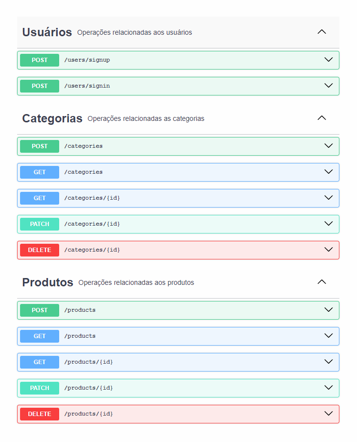
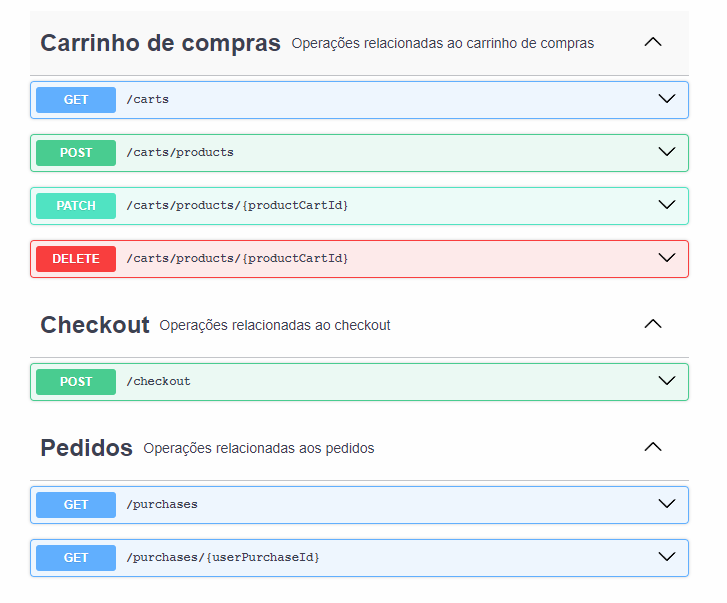

# Technical test (Dev Backend Mid-level)

<div align="center">
</br>
  
  
  
  
  
  
  </br>
</div></br>

Este teste foi projetado para avaliar minhas habilidades em Node.js e gerenciamento de banco de dados. O objetivo é criar uma API RESTful funcional simulando um marketplace com foco em boas práticas de desenvolvimento, desempenho e segurança.

Para mais detalhes sobre os requisitos funcionais, [clique aqui](/docs/requirements.md).

## 🚀 Tecnologias

- [Node.js](https://nodejs.org/en/)
- [NestJS](https://nestjs.com/)
- [PostgreSQL](https://www.postgresql.org/)
- [TypeORM](https://typeorm.io/)
- [Docker](https://www.docker.com/)

### Sumário
  * [Estrutura do Projeto](#-estrutura-do-projeto)
    * [Diretório `src`](#diretório-src)
    * [🛡️👮 Segurança](#️-segurança-e-garantia-do-funcionamento)
      * [🧪 Testes unitários](#-testes-unitários)
    * [🛢️ Banco de dados](#️-banco-de-dados)
</br>
  * [Instruções para execução](#-instruções-para-execução)
    * [🐳 Docker](#-docker)
    * [⬇️ Instalando dependências](#️-instalando-dependências)
    * [🛢️ Executando as migrations](#️-executando-as-migrations)
    * [🚀 Executando a aplicação](#-executando-a-aplicação)
    * [🌐 Endpoints da API](#endpoints-da-api)

</br>

---

## 🛠️👷 Estrutura do Projeto

### Diretório `src`
Este diretório contém o código-fonte principal do projeto, organizado em módulos e casos de uso, com uma clara separação de responsabilidades.

- **`app/`** - Contém a configuração principal da aplicação e os módulos.
  - **`modules/`** - Cada camada é encapsulada em seu próprio módulo.
    - **`app/`** - Módulo principal da aplicação.
    - **`database/`** - Configurações e módulos relacionados ao banco de dados.
    - **`http/`** - Módulo responsável pelas operações HTTP, incluindo controladores.
  - **`useCases/`** - Implementação de casos de uso específicos, como autenticação e operações de carrinho.
- **`core/`** - Contém código central que pode ser usado por múltiplos módulos na aplicação. Inclui validadores de requisiçoes, guards, interfaces, middlewares, pipes, providers e utilitários.
- **`database/`** - Contém entidades, fontes de dados e repositórios para interação com o banco de dados.

Foi utilizado o padrão de arquitetura `Clean Architecture` para organizar o código-fonte, garantindo uma separação clara de responsabilidades e facilitando a manutenção e evolução do projeto.

**Referências**: 

Já algum tempo tenho tido esse artigo sobre aplicação do SOLID em NestJS como uma boa arquitura a se seguir, então deixarei aqui para referência: 

[*NestJS SOLID principles and folder structure*](https://mobileappcircular.com/marketplace-backend-nestjs-solid-principles-and-folder-structure-82cc72a82490)

Mas é claro que fiz algumas modificações, como não modularizar todas as entidades do banco e suas operações, pois achei que não seria necessário para esse projeto.

Mas foi modularizado as camadas de protocólos, como por exemplo, a camada de `http` e `database`.

Tendo em vista que nem todas as ferramentas necessitam de controladores e arquiteturas REST, apesar de ser um teste prático com foco em API REST, foi pensado na escalabilidade e futuras implementaçõees, por isso tem a separação dos casos de uso da aplicação e a camada de `http` que é responsável por lidar com as requisições.

</br>

### 🛡️👮 Segurança e garantia do funcionamento.

Todas os endpoints que fazem manipulações de escrita/atualização no banco de dados, estão protegidos por autenticação JWT, garantindo que apenas usuários autenticados possam manipular os dados.

Além disso eles estão seguros por validações de entrada, garantindo que os dados fornecidos sejam válidos e seguros.

Assegurando que apenas produtos existentes possam ser atualizados/deletados, apenas carrinhos de compras com produtos válidos possam ser finalizados, e outras validações de integridade.

### 🧪 Testes unitários

Foi feito testes unitários em 100% dos casos de uso e dos principais componentes, porém faltou os teste dos validadores de requisições. (Por conta do tempo). Para mais detalhes sobre os testes, [clique aqui](/docs/tests.md).

</br>

## 🛢️ Banco de dados

Foi utilizado o banco de dados PostgreSQL, com o ORM TypeORM para interação, para mais detalhes sobre a estrutura do banco de dados, [clique aqui](/docs/database.md), e veja o diagrama de entidades e relacionamentos, além de uma **descrição detalhada** de cada entidade.

</br>

---

# 🚀 Instruções para execução

Primeiramente precisamos configurar o .env, para isso, copie o arquivo `.env.example` e renomeie para `.env`, **não é necessário alterar nada**, mas caso queira, altere as variáveis de ambiente.

#### 🐳 Docker

Para executar e subir o **banco de dados**, basta executar o comando:

```bash
docker-compose up -d --build
```

#### ⬇️ Instalando dependências

```bash
yarn install
# ou
npm install
```

#### 🛢️ Executando as migrations

!Muito importante executar as migrations antes de iniciar a aplicação, para criar as tabelas e relacionamentos no banco de dados.

```bash
yarn typeorm:migrate
# ou
npm run typeorm:migrate
```

#### 🚀 Executando a aplicação

Após a execução das migrations, podemos iniciar a aplicação com segurança, para isso execute o comando:
a aplicação será executada por padrão no endereço `http://localhost:3000`

```bash
yarn start:dev
# ou
npm run start:dev
```

## Endpoints da API

Infelizmente por conta do prazo **não foi possível finalizar o swagger**, mas segue abaixo os endpoints disponíveis junto com o postman collection:




Por não ter o swagger finalizado, irei deixar o postman collection para facilitar a execução dos testes.

🚀 Crie um fork da collection para testar corretamente. **Caso não consiga** fazer o fork, baixe a collection [clicando aqui](./docs/postman/felipe_dos_anjos_technical_test.postman_collection.json) e importe no seu postman.

[](https://www.postman.com/crimson-escape-751617/workspace/public/collection/27687099-d638b418-b03f-460c-b81c-7570fedd5f47?action=share&creator=27687099&active-environment=27687099-9bdc464c-bbc2-429c-b53e-d15e84335644)

**Atenção**: É só criar um usuário na aplicação e fazer login, após isso, o token de autenticação é automaticamente setado para todos os endpoints.
