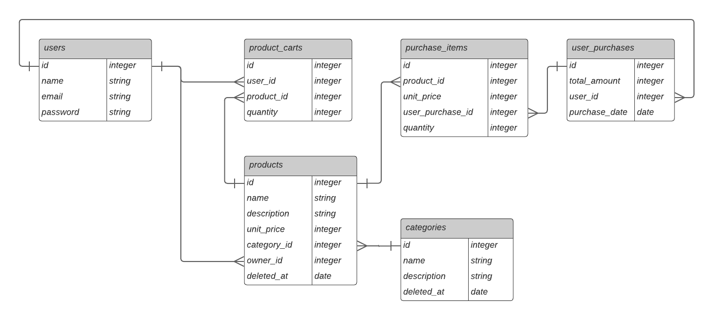

# Entendendo o banco de dados

### Diagrama ER (Entidade e Relacionamento)

**OBS**: Os dados como categoria e produtos não são excluídos do banco de dados, apenas marcados como excluídos, para manter o histórico de compras e carrinhos de compras dos usuários. (Soft Delete).

 

## Entidades

### 📄 Categoria (`CategoryEntity`)
Representa as categorias de produtos no sistema.

| Atributo        | Tipo             | Descrição                                                 |
|-----------------|------------------|-----------------------------------------------------------|
| **id**          | `number`         | Identificador único da categoria, gerado automaticamente. |
| **name**        | `string`         | Nome da categoria, indexado para busca rápida.            |
| **description** | `string \| null` | Descrição opcional da categoria.                          |
| **deleted_at**  | `Date \| null`   | Data de exclusão lógica da categoria, se excluída.        |

**Relacionamentos:**
- **OneToMany**: Cada categoria pode ter vários produtos associados (`ProductEntity`).

 

### 📄 Produto (`ProductEntity`)
Detalha os produtos disponíveis para venda.

| Atributo        | Tipo     | Descrição                                               |
|-----------------|----------|---------------------------------------------------------|
| **id**          | `number` | Identificador único do produto, gerado automaticamente. |
| **name**        | `string` | Nome do produto.                                        |
| **price**       | `number` | Preço do produto.                                       |
| **category_id** | `number` | ID da categoria à qual o produto pertence.              |

**Relacionamentos:**
- **ManyToOne**: Cada produto está associado a uma categoria (`CategoryEntity`).

 

### 📄 Carrinho de Produtos (`ProductCartEntity`)
Associa produtos a um carrinho de compras de um usuário.

| Atributo       | Tipo     | Descrição                                                |
|----------------|----------|----------------------------------------------------------|
| **id**         | `number` | Identificador único do carrinho, gerado automaticamente. |
| **user_id**    | `number` | ID do usuário proprietário do carrinho.                  |
| **product_id** | `number` | ID do produto adicionado ao carrinho.                    |
| **quantity**   | `number` | Quantidade do produto no carrinho.                       |

**Relacionamentos:**
- **ManyToOne**: Cada item do carrinho está associado a um usuário e um produto.

 

### 📄 Compra (`UserPurchaseEntity`)
Registra as compras realizadas por um usuário.

| Atributo    | Tipo     | Descrição                                              |
|-------------|----------|--------------------------------------------------------|
| **id**      | `number` | Identificador único da compra, gerado automaticamente. |
| **user_id** | `number` | ID do usuário que realizou a compra.                   |

**Relacionamentos:**
- **OneToMany**: Uma compra pode conter vários itens (`PurchaseItemEntity`).

 

### 📄 Item de Compra (`PurchaseItemEntity`)
Detalha os itens de uma compra.

| Atributo        | Tipo     | Descrição                                                      |
|-----------------|----------|----------------------------------------------------------------|
| **id**          | `number` | Identificador único do item de compra, gerado automaticamente. |
| **purchase_id** | `number` | ID da compra à qual o item pertence.                           |
| **product_id**  | `number` | ID do produto comprado.                                        |
| **quantity**    | `number` | Quantidade comprada do produto.                                |

**Relacionamentos:**
- **ManyToOne**: Cada item de compra está associado a uma compra e a um produto.

 

### 📄 Usuário (`UserEntity`)
Representa os usuários do sistema.

| Atributo     | Tipo     | Descrição                                               |
|--------------|----------|---------------------------------------------------------|
| **id**       | `number` | Identificador único do usuário, gerado automaticamente. |
| **email**    | `string` | E-mail do usuário.                                      |
| **password** | `string` | Senha criptografada do usuário.                         |

**Relacionamentos:**
- **OneToMany**: Um usuário pode ter vários carrinhos de compras (`ProductCartEntity`) e compras realizadas (`UserPurchaseEntity`).

 

