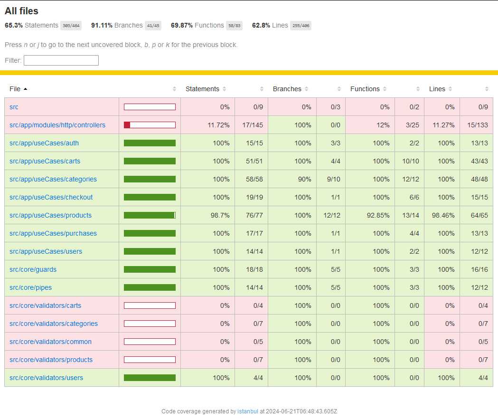
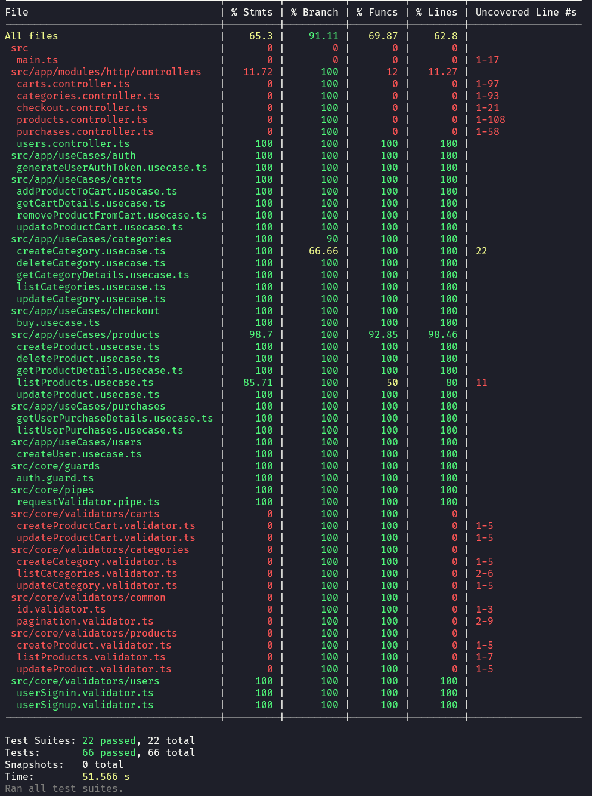

# Testes

Não foi feito nenhum teste end-to-end, mas a aplicação foi testada manualmente e está funcionando corretamente.

Os testes unitários foram feitos em 100% dos casos de usos e dos principais componentes, porém faltou os teste dos validadores de requisições. (Por conta do tempo).

</br>

[](../README.md#-testes-unitários)


## Testes unitários (Coverage)




## Para executar os testes

```bash
yarn test
# ou
npm run test
```

</br>

[](../README.md#-testes-unitários)
